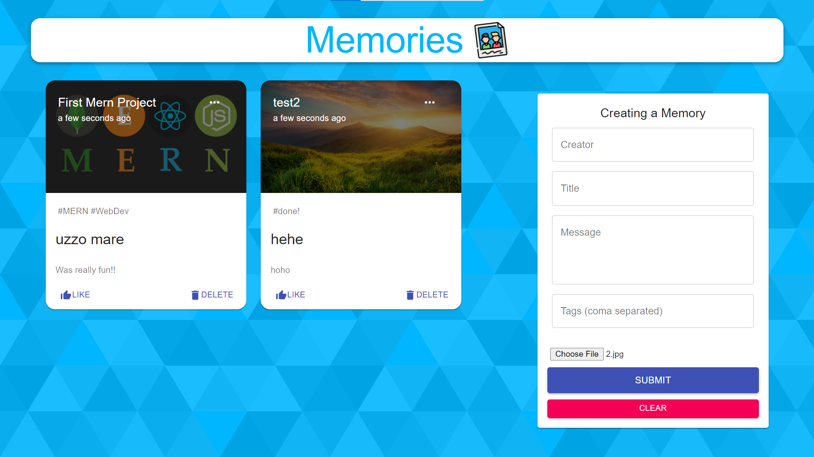

# Web Dev

## Goal

Learn Web Dev with minimum time and effort using experience gained from app and game dev.

## Resources

Notes from Code with Harry

https://youtube.com/playlist?list=PL80ETrTLtfAy-ftZ8obdt6PZLmV7o3FJq

https://youtube.com/playlist?list=PL80ETrTLtfAyxOn5Uk96EHGtt1ulDn3N2

https://youtube.com/playlist?list=PL6QREj8te1P7VSwhrMf3D3Xt4V6_SRkhu

## Plan

Step1: Revise html, css, js  
Step2: 2 Mini Projects 

Step3: Learn M E R N  
Step4: 2 Projects: 

- Quote app 
- Memories App (CRUD)

 
I have written notes for quick rev too
